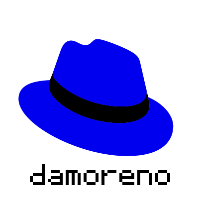

# Blue Hat

Welcome to Blue Hat, an exercise created by the CPaaS team.

## Instructions

Oh man, the marketing team has gone totally crazy again.

First, they got rid of Shadowman. And now they want to change the primary color from red to blue!

You have been tasked to automate the process of creating new custom stickers to promote the new brand.

What's a custom sticker?

A custom sticker is nothing else than a 400x400 image of our wonderful ~~red~~ blue hat with the name of the Blue Hat
employee than bought it. Unfortunately, the designers haven't come up with the new logo yet, so you will have to begin
recoloring the old one.

## Recoloring the logo

You'll start with the following image, which you can find in the repo files:


Nice thing about this logo is that recoloring it is as simple as switching `red` and `blue` components for each pixel.
So, if a pixel contains `RGBA(255, 40, 20, 0)` you just have to replace it with `RGBA(20, 40, 255, 0)`.

As a tip, you should rely on [image](https://pkg.go.dev/image) to deal with images in Go.

## Adding the name

### Parsing the file

In this repository you will also find a file named `ascii_maps` with the following content:

```
A 01110100011000110001111111000110001
a 00000000000111000001011111000101111
B 11110100011000111110100011000111110
b 10000100001000011110100011000111110
C 01110100011000010000100001000101110
c 00000000000111010001100001000101110
...
```

Each line is componsed by an ascii character and its representation in a 5x7 panel. Here's how each line is structured:

```
ASCII WHITESPACE ENCODING
```

The encoding part shows a zero if a pixel in the 5x7 panel has to be off and a 1 if it should be on. For example, the
first row in the example above would generate the following panel:

```
01110
10001
10001
10001
11111
10001
10001
```

Once the information is translated into pixels within the image, you should get this:

```
 xxx 
x   x
x   x
x   x
xxxxx
x   x
x   x
```

### Generating the name

Now that the file is parsed, you have to write a function to transform a given username (max 11 characters long), into a
banner with all letters' representation separated by a space (empty column):

```
    X                                           
    X                                           
    X  XXX  XXXX   XXX  X XXX  XXX  XXXX   XXX  
 XXXX     X X X X X   X XX    X   X X   X X   X 
X   X  XXXX X X X X   X X     XXXXX X   X X   X 
X   X X   X X X X X   X X     X     X   X X   X 
 XXXX  XXXX X X X  XXX  X      XXXX X   X  XXX  
```

### Scaling and drawing

The banner as it is would be too small to draw in our 400x400 image, so each point in the banner should be scaled by 6.
One way to do this is by drawing a 6x6 square in the image per point in the banner. You can take a look into [Rect](https://pkg.go.dev/image#Rect) and 
[image/draw](https://pkg.go.dev/image/draw) to do this.

The only thing left to be done is to draw the name, centered, into the Blue Hat logo image you generated before. The expected
result should be similar to this:



## Source

### Created by

- @damoreno
